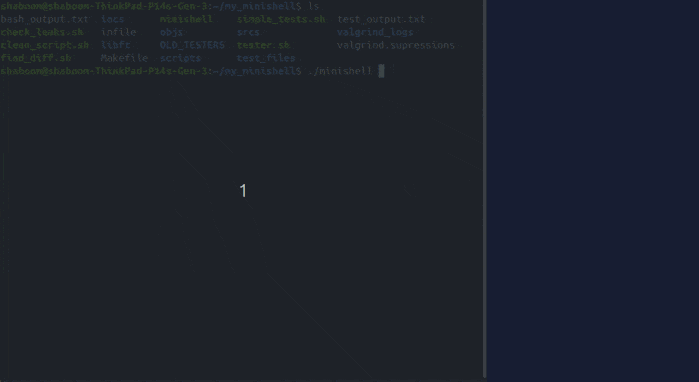

## Project Overview

This project is a simplified Unix shell built in C as part of the Hive Helsinki curriculum. It supports:

- Built-in commands (e.g. `cd`, `echo`, `exit`)
- Piping and forking
- Signal handling and redirection
- Tokenization and parsing
- Bash-like behavior for basic command execution, using Bash as reference.
- The subject enforced strict rules on code structure, such as:
    • Maximum 25 lines per function
    • 80 characters per line
    • 5 functions per file
    • A restricted set of allowed library functions: readline, printf, malloc, free, write, fork, execve, pipe, dup2, wait, kill, signal, open, read, close, and others from a limited POSIX-compatible list.

The goal was to deepen our understanding of system-level programming, process management, and memory handling in C.
>"With Minishell, you’ll travel back in time and experience the challenges developers faced before Windows existed."

## My Role in the Project

This was our first group project at Hive Helsinki, and we came into it with a very hands on mindset. Instead of doing much upfront planning, we dove in, mostly out of  excitement and learned by building. We kicked things off with a simple `main` function and started testing against Bash as we added features.

Early on, we split tasks: my partner focused on built in commands, while I took on parsing and tokenization. As the project evolved, I moved on to piping and forking, while she handled signal handling, redirection, and expansion.
that said, a lot of our work was highly collaborative. We often shared a machine, solving problems side by side, one of the most fun and rewarding parts of the whole experience.
When we weren’t sure how to approach something, we tackled it together.

Toward the end, we shifted into cleanup mode to meet the strict subject requirements. This phase really helped me understand the value of short, modular functions. My partner had a great eye for structure and code clarity, and I learned a lot just by refining things with them.

Somewhere along the way, I started experimenting with Bash scripting as a way to test our shell. It ended up being way more accessible than I expected.
I encouraged my partner to try it too they ran with it, and while I was a little envious I couldn’t dive in deeper myself, I stayed focused on finishing my section so we could move forward together.

This version of the shell reflects our final push before submission. I haven’t worked on it since, but I walked away with a much deeper understanding of parsing, process management, and how rewarding real collaboration can be.
I’d love to revisit it someday if time permits.
### Using the Shell and tester.sh

  

## Lessons Learned 💡

- **Start with a plan.**  
  In hindsight, we could’ve saved hours of troubleshooting by spending more time upfront on structure, responsibilities, and edge cases. That said, wrestling with ambiguity taught us how to adapt quickly
  which turned out to be just as valuable.

- **Write code with intention.**  
  Early on, I just wrote code that “worked.” Later, I saw how short, clean, and modular functions especially under strict constraints made the entire project easier to understand, debug, and refine.

- **Know your tools (and their limits).**  
  This project gave me a sharper grasp on pointers, memory management, and process behavior in C. It also taught me how to use Git more effectively with a partner and just as importantly, how *not* to use it.

- **Good collaboration takes practice.**  
  We weren’t working under ideal conditions holidays, unclear specs, limited experience but by sharing a machine and leaning on each other, we got through it. I learned a lot about communication, patience, and working as a team.

- **Don’t write off tools that seem intimidating.**  
  Bash scripting looked overwhelming at first. But once I gave it a shot, I realized how powerful it was for debugging and testing and how fun it was to learn. That experience changed how I approach unfamiliar tools now.
